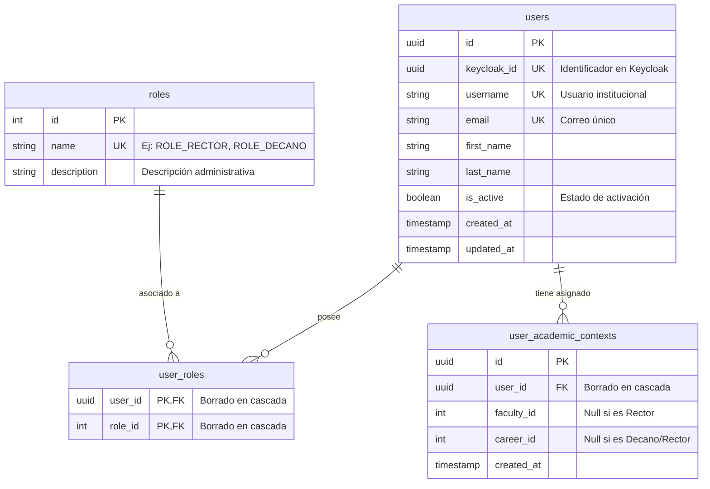

# Propuesta de Modelo Entidad-Relación Mejorado (ERD)

Este documento contiene la propuesta de mejora para el modelo de base de datos del **Servicio de Autenticación (auth-service)**. Se ha diseñado con un enfoque pragmático para resolver las limitaciones del diseño inicial, pensando en la consistencia de datos, auditoría y evolución del sistema.

---

## 1. Análisis de Limitaciones del Modelo Inicial

1. **Falta de Trazabilidad (Auditoría):** En entornos de producción, las tablas críticas como `users` y `user_academic_contexts` no tenían fecha de creación (`created_at`) ni de modificación (`updated_at`), lo cual dificulta la depuración de incidentes y auditorías de seguridad.
2. **Cardinalidad Rígida en el Contexto Académico (1:1):** El modelo inicial limitaba a un usuario a tener exactamente un único contexto académico (`USER ||--o| USER_ACADEMIC_CONTEXT`). En la realidad universitaria, un docente o administrativo puede tener asignaciones concurrentes (ej. Director de la Carrera A y Decano interino de la Facultad B). Restringirlo a 1:1 generaría bloqueos arquitectónicos a futuro.
3. **Ausencia de Restricciones Lógicas (Check Constraints):** En el contexto académico, si un usuario tiene un `career_id` (Carrera), lógicamente *debe* tener un `faculty_id` (Facultad), ya que las carreras pertenecen a facultades. El modelo inicial permitía inconsistencias (como tener carrera pero no facultad).
4. **Falta del Identificador de Login (`username`):** Keycloak autentica mediante correos o nombres de usuario. Almacenar únicamente el `email` limita el soporte para inicios de sesión basados en nombres de usuario institucionales (ej: `user1`).

---

## 2. Cambios Propuestos e Impacto

| Tabla | Campo Propuesto | Tipo | Justificación / Impacto |
| :--- | :--- | :--- | :--- |
| **USERS** | `username` | `VARCHAR(50) UK` | Soporte para inicios de sesión con nombre de usuario institucional. |
| **USERS** | `created_at` / `updated_at` | `TIMESTAMP` | Auditoría de creación y última actualización del perfil. |
| **ROLES** | `description` | `VARCHAR(255)` | Descripción amigable del rol para interfaces administrativas (ej: "Director de Carrera"). |
| **USER_ACADEMIC_CONTEXT** | `CHECK constraint` | SQL Rule | Regla de consistencia: `CHECK (career_id IS NULL OR faculty_id IS NOT NULL)`. |
| **USER_ACADEMIC_CONTEXT** | `created_at` | `TIMESTAMP` | Registro histórico de cuándo se le otorgó el contexto académico al usuario. |
| **Relaciones** | `USER` a `CONTEXT` (1:N) | Cardinalidad | Cambiado de `1:1` a `1:N` para permitir múltiples contextos simultáneos a un usuario. |

---

## 3. Modelo ERD Propuesto (Mermaid)



---

## 4. Representación física del DDL (PostgreSQL)

Para facilitar la revisión técnica, a continuación se detalla cómo se traduciría este diseño mejorado a sentencias DDL reales de PostgreSQL, aplicando las reglas de consistencia de datos y borrado en cascada:

```sql
-- 1. Tabla de Usuarios (Sincronizada localmente desde Keycloak)
CREATE TABLE users (
    id UUID NOT NULL,
    keycloak_id UUID NOT NULL,
    username VARCHAR(50) NOT NULL,
    email VARCHAR(320) NOT NULL,
    first_name VARCHAR(100),
    last_name VARCHAR(100),
    is_active BOOLEAN NOT NULL DEFAULT TRUE,
    created_at TIMESTAMP NOT NULL DEFAULT CURRENT_TIMESTAMP,
    updated_at TIMESTAMP NOT NULL DEFAULT CURRENT_TIMESTAMP,
    CONSTRAINT pk_users PRIMARY KEY (id),
    CONSTRAINT uc_users_keycloak_id UNIQUE (keycloak_id),
    CONSTRAINT uc_users_username UNIQUE (username),
    CONSTRAINT uc_users_email UNIQUE (email)
);

-- 2. Tabla de Roles del Sistema
CREATE TABLE roles (
    id INT NOT NULL,
    name VARCHAR(50) NOT NULL,
    description VARCHAR(255),
    CONSTRAINT pk_roles PRIMARY KEY (id),
    CONSTRAINT uc_roles_name UNIQUE (name)
);

-- 3. Tabla Intermedia: Relación Muchos a Muchos (M:N) entre Usuarios y Roles
CREATE TABLE user_roles (
    user_id UUID NOT NULL,
    role_id INT NOT NULL,
    CONSTRAINT pk_user_roles PRIMARY KEY (user_id, role_id),
    CONSTRAINT fk_user_roles_on_user FOREIGN KEY (user_id) REFERENCES users (id) ON DELETE CASCADE,
    CONSTRAINT fk_user_roles_on_role FOREIGN KEY (role_id) REFERENCES roles (id) ON DELETE CASCADE
);

-- 4. Contexto Académico (segregación de acceso para RNF4.1)
CREATE TABLE user_academic_contexts (
    id UUID NOT NULL,
    user_id UUID NOT NULL,
    faculty_id INT,
    career_id INT,
    created_at TIMESTAMP NOT NULL DEFAULT CURRENT_TIMESTAMP,
    CONSTRAINT pk_user_academic_contexts PRIMARY KEY (id),
    CONSTRAINT fk_user_academic_contexts_on_user FOREIGN KEY (user_id) REFERENCES users (id) ON DELETE CASCADE,
    -- Regla de integridad: Si tiene carrera asignada, obligatoriamente debe definirse su facultad
    CONSTRAINT chk_career_requires_faculty CHECK (career_id IS NULL OR faculty_id IS NOT NULL)
);
```
